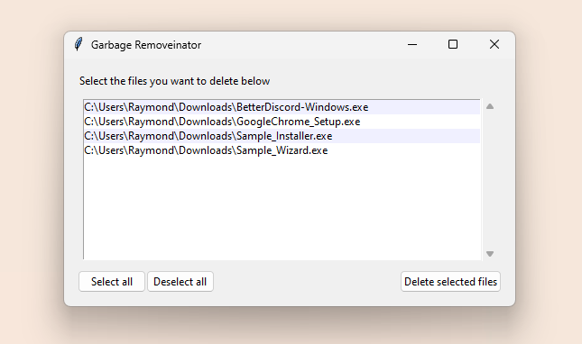

# Garbage Removal Utility for Windows

A basic tool to assist in removing any forgotten or leftover installer files from (almost) anywhere in your system.

On a lesser note, this project is mostly a personal learning adventure in combining multiple programming languages and making a GUI using Python's standard Tkinter library.

## Build Dependencies
**Python (3.0+)**
> [Download Python](https://www.python.org "Click here to redirect!")

**C++ (2017+)**
> [Download MSYS2](https://www.msys2.org "Click here to redirect!")

## Contributors
**Raymond Chen** - *sameriterl* (Discord)
