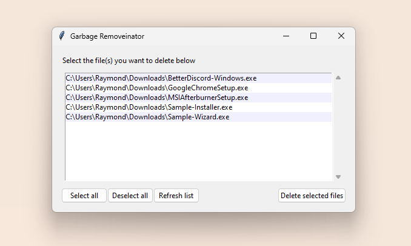

# Garbage Removal Utility for Windows

A basic and powerful tool to assist in removing leftover installer files from almost anywhere on your system.

On a side note, this project is meant to help me learn how to do a bunch of different things:
- Using multiple programming languages in collaboration
- Traversing and managing Windows files using code
- Creating GUI using Python's standard Tkinter library
- Compiling different file types together into single binaries
- Exploring various GitHub tools

## Build Dependencies
**Python (3.7+)**
> [Download Python](https://www.python.org "Click here to redirect!")

**PyInstaller**
> `pip install pyinstaller` \
> [Getting Started & Documentation](https://pyinstaller.org/en/stable "Click here to redirect!")

**C++ (2017+)**
> [Download MSYS2](https://www.msys2.org "Click here to redirect!")

## Contributors
**Raymond Chen** - *sameriterl* (Discord)
